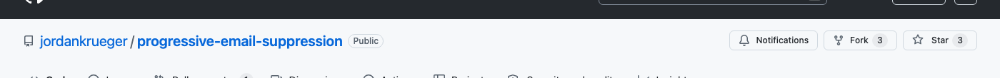
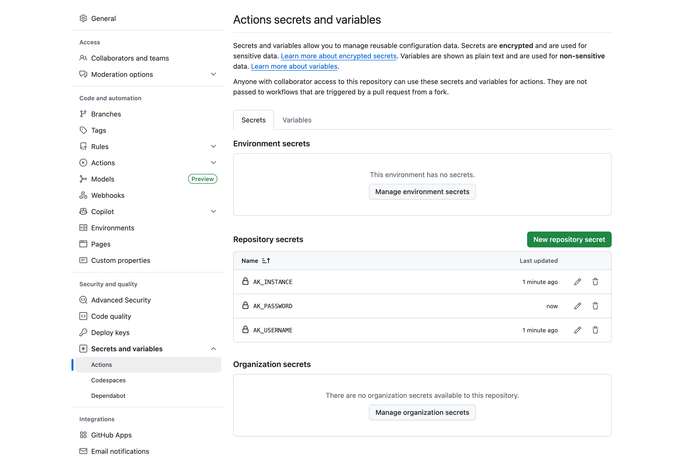
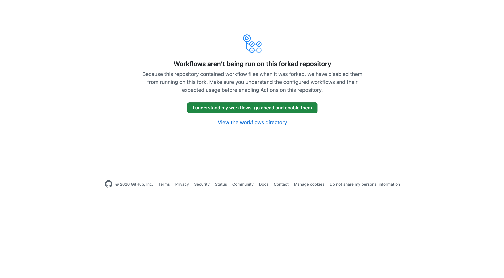
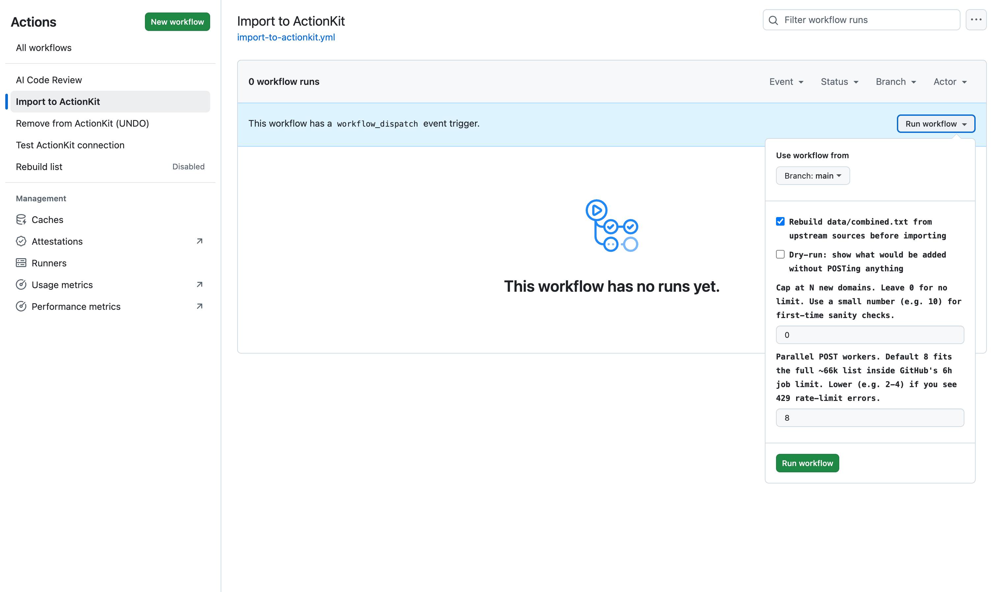
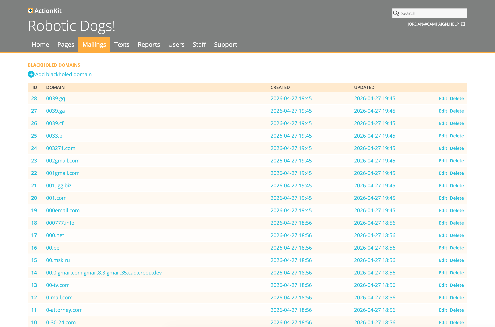
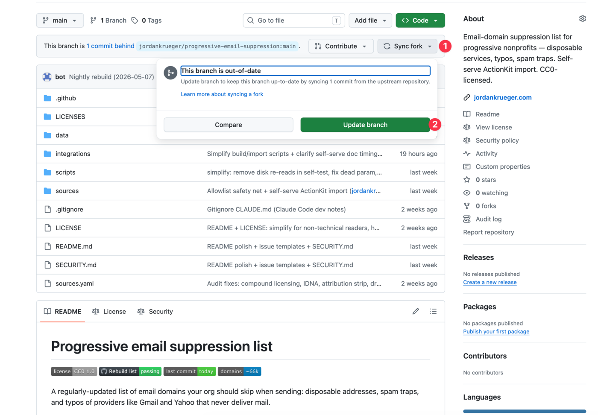

# Self-serve ActionKit import

This guide walks you through importing the suppression list into your ActionKit instance's Blackhole Domains list, **without writing any code or asking ActionKit support to do it for you**.

You'll fork this repo into your own GitHub account, add three secret values that tell GitHub how to reach your ActionKit instance, and click a button. GitHub Actions runs the import on its servers, then tells you what happened.

## The short version

Four phases, in order:

1. **Set up** (about 10 minutes, once) — fork the repo, add three secrets, enable Actions.
2. **Test the connection** (5 seconds) — confirm your secrets work before you start a long-running import.
3. **Sanity-check** (2 minutes) — dry-run + a 10-domain test import so you can see entries land in AK admin.
4. **Run the full import** (1-2 hours, hands-off) — kick it off, walk away, check back later.

There are three workflows in the Actions tab once you fork:

- **Test ActionKit connection** — read-only pre-flight check. Use this first.
- **Import to ActionKit** — the main event. Adds suppression-list domains to your Blackhole list.
- **Remove from ActionKit (UNDO)** — destructive undo. Removes suppression-list domains from your Blackhole list. Read the warnings before running.

A nightly **rebuild** workflow also exists; you do *not* need to enable or run it. It only matters for keeping your fork's local copy of the data current, which the import workflow handles automatically when you check "rebuild first."

> **The 6-hour ceiling.** GitHub kills any single Actions job at exactly 6 hours, no exceptions. The default 8 workers normally finish the full ~66k list well inside that, but a slow AK instance can run long. If a run hits the ceiling, just **re-run the workflow** — the script is idempotent and picks up where it left off (it sees what's already in your Blackhole list and only POSTs the rest). One re-run almost always completes the job.

---

## What you need before you start

Three pieces of information about your ActionKit instance:

| Name | What it is | Example |
|---|---|---|
| **Instance hostname** | The web address of your AK admin panel, *without* `https://` and *without* any path | `yourorg.actionkit.com` |
| **API username** | The ActionKit user account that has API access. Often a dedicated "api" user. | `api-bot` |
| **API password** | The password for that user account. | (a long string) |

A few practical notes:

- **Use a dedicated API user.** Don't use your personal admin login. A dedicated user (often named `api`, `api-bot`, or `integrations`) is easier to rotate and audit, and rate limits apply per user.
- **The API user must not have 2FA enabled.** Basic authentication doesn't support 2FA. If your API user has it on, the import will fail at the auth step.
- **If your org has more than one AK instance** (e.g., a staging and a production instance), pick the one you actually want suppressed. You can re-run this against multiple instances if needed — each fork talks to one instance at a time.

If you're not sure what these are, ask whoever administers your ActionKit instance.

You also need a **GitHub account**. Free is fine. If you don't have one, create it at [github.com](https://github.com).

---

## One-time setup

### Step 1: Fork this repository

A "fork" is your own personal copy of this repository. Your secrets will live in your fork — they never get sent back to us.

1. Go to **https://github.com/jordankrueger/progressive-email-suppression**
2. Click the **Fork** button in the top-right corner
3. On the next page, leave everything as default and click **Create fork**

You now have your own copy at `https://github.com/YOUR-USERNAME/progressive-email-suppression`.



### Step 2: Add your three ActionKit secrets

GitHub stores these in an encrypted vault inside your fork. Only your workflow runs can read them; they aren't visible to anyone (not even to you, after you save them).

1. In **your fork**, click **Settings** (top tab, far right)
2. In the left sidebar, click **Secrets and variables**, then **Actions**
3. Click the green **New repository secret** button
4. Add the first secret:
   - **Name:** `AK_INSTANCE`
   - **Secret:** your instance hostname (e.g. `yourorg.actionkit.com` — no `https://`, no trailing `/`, no `/admin`)
   - Click **Add secret**
5. Click **New repository secret** again. Add:
   - **Name:** `AK_USERNAME`
   - **Secret:** your AK API username
   - Click **Add secret**
6. Click **New repository secret** one more time. Add:
   - **Name:** `AK_PASSWORD`
   - **Secret:** your AK API password
   - Click **Add secret**

When you're done, the Secrets page lists three secrets: `AK_INSTANCE`, `AK_PASSWORD`, `AK_USERNAME`. (GitHub sorts them alphabetically.)



### Step 3: Enable Actions in your fork

GitHub disables Actions in newly-created forks by default. Turn them on.

1. In your fork, click the **Actions** tab (top of the page)
2. You'll see a yellow banner: **"Workflows aren't being run on this forked repository."**
3. Click the green **I understand my workflows, go ahead and enable them** button



### Step 4: Test the connection

Before running a real import, run the pre-flight check. It takes 5 seconds and confirms your secrets work without changing anything in AK.

1. In your fork, click the **Actions** tab
2. In the left sidebar, click **Test ActionKit connection**
3. On the right, click the **Run workflow** dropdown, then click the green **Run workflow** button
4. A run appears in the list within a few seconds. Click it, then click into the **test** job to see the live log.

A successful run looks like this:

```
Checking ActionKit connection...

  ✓ Environment variables set (AK_INSTANCE, AK_USERNAME, AK_PASSWORD)
  ✓ AK_INSTANCE looks like a hostname: yourorg.actionkit.com
  ✓ DNS + HTTPS connection to yourorg.actionkit.com OK
  ✓ Authenticated as api-bot
  ✓ API access OK — read /rest/v1/blackholeddomain/ successfully

Your Blackhole list currently has 1,234 domain(s).

Connection check passed. You're ready to run Import to ActionKit.
```

If you see a **✗** anywhere, the log includes a friendly diagnosis pointing at the most common cause. Read it, fix the secret it points at, and run **Test ActionKit connection** again. Don't move on to the import until this is fully green — every problem this catches will *also* show up in the import, but it'll waste a lot more of your time there.

---

## Run the import

Once **Test ActionKit connection** is green, run the import:

1. In your fork, click the **Actions** tab
2. In the left sidebar, click **Import to ActionKit**
3. On the right, click the **Run workflow** dropdown
4. Leave **rebuild first** checked (recommended — uses the freshest list)
5. Click the green **Run workflow** button



A new run appears in the list within a few seconds. Click it, then click into the **import** job to see the live log. You'll see lines like `200/53,766 (200 added, 0 failed) 16.2/sec ETA 55m 12s` ticking up as it works.

**A full first-time import typically takes 1-2 hours.** The script POSTs to ActionKit with 8 parallel workers by default; actual speed depends on your AK instance's response time. Progress prints every 100 domains or every 30 seconds, whichever comes first, so you can confirm it's still moving. You can close the browser tab and come back later — the run continues on GitHub's servers either way.

If you see HTTP 429 (rate-limit) errors in the log, your AK instance is asking the script to slow down. Re-run with **workers** lowered to `4` or `2`.

If you want it *faster* and your AK instance is robust, bump **workers** to `16`. The script auto-retries on rate-limit errors with backoff, so cranking it up is safe to try — if AK pushes back, the run will slow down on its own.

### Recommended for first-time runs: sanity-check first

Before importing all 66k domains, do a small test run to confirm the round-trip works end-to-end:

1. **Dry-run.** Check the **dry-run** box on the **Run workflow** form. Nothing gets POSTed; the log shows the first 20 domains it *would* add. If those look like real disposable/typo domains, you know the connection and data are good.
2. **Import 10 real entries.** Set **limit** to `10` (instead of the default `0`) and run again. This adds 10 actual entries. Open AK admin → **Mailings → List Hygiene → Blackhole** within seconds and confirm you see them.
3. **Run the full import.** Run once more with **limit** back at `0` and **dry-run** unchecked.

### What success looks like

A successful full run ends with something like this in the workflow log:

```
Loaded 66,169 domains from data/combined.txt
Connecting to yourorg.actionkit.com as api-bot...
Found 12,403 domains already in your Blackhole list

Adding 53,766 new domain(s) with 8 parallel worker(s)...

  100/53,766  (100 added, 0 failed)  16.4/sec  ETA 54m 32s
  200/53,766  (200 added, 0 failed)  16.7/sec  ETA 53m 31s
  ...
Done. 53,766 added, 0 failed in 3,210s (16.7/sec).
```

In ActionKit admin, **Mailings → List Hygiene → Blackhole** now shows the imported entries. ActionKit propagates new blackhole entries to existing users in under 20 minutes (per AK's docs) — meaning anyone already on your list whose email matches a newly-blocked domain gets their subscription state updated automatically. You don't need to do anything else.



### Re-running and updates

The import is **idempotent** — re-running it is always safe. It checks what's already in your AK instance and only adds what's new.

This repo's `data/combined.txt` is rebuilt nightly from upstream sources, so the canonical list slowly grows. To pick up new additions, just re-run **Import to ActionKit** with the **rebuild first** box checked. The "rebuild first" step pulls the latest upstream sources before importing, so you don't need to worry about your fork being out of date. **A quarterly re-run is plenty for most orgs**; the rate of net-new bad domains is slow.

---

## Undoing an import

If you imported to the wrong instance, want to start over, or no longer want the suppression list applied, run **Remove from ActionKit (UNDO)** to delete the imported entries.

> ⚠️ **This is destructive.** It removes EVERY domain in `data/combined.txt` from your Blackhole list, including any that were there *before* our import. There's no way to distinguish "added by our import" from "added some other way" once they're in AK. **If pre-existing entries matter, back up your Blackhole list first** — copy the entries you want to preserve, either from the AK admin UI or via the API (`GET /rest/v1/blackholeddomain/?_limit=200`, paginated).

To run the undo:

1. In your fork, click the **Actions** tab
2. In the left sidebar, click **Remove from ActionKit (UNDO)**
3. Click **Run workflow** — the form has a **confirm** checkbox that's unchecked by default
4. **First click without the confirm box checked.** This is a dry run — the log lists what would be deleted but does nothing. Read the list. Confirm it matches what you want gone.
5. **Then run again with confirm checked.** This actually deletes the entries.

The undo respects the same `--workers` knob as the import (default 8). If your earlier import had ~50k entries to add, the undo will have a similar wall-clock time.

---

## If something goes wrong

This is a decision tree. Find what you saw, follow the fix.

**"Missing required repository secret(s)"**
You skipped Step 2, or one of the secret names is misspelled. Names are case-sensitive: `AK_INSTANCE`, `AK_USERNAME`, `AK_PASSWORD`. Go back to **Settings → Secrets and variables → Actions** and check.

**Test connection says ✗ "Could not look up ... in DNS"**
The hostname in `AK_INSTANCE` doesn't exist. Most likely a typo. The log shows what you set and what it should look like. Update the secret in **Settings → Secrets and variables → Actions** (click the pencil icon) and re-run **Test ActionKit connection**.

**Test connection says ✗ "ActionKit returned HTML, not JSON"**
`AK_INSTANCE` has a path in it (e.g. you pasted `yourorg.actionkit.com/admin`). Set it to *just* the hostname.

**Test connection says ✗ "ActionKit rejected the credentials (HTTP 401)"**
The username or password is wrong, or the user account doesn't have API access, or the user has 2FA enabled (which doesn't work with Basic auth). Verify with whoever administers your AK instance, then update the offending secret.

**Test connection says ✗ "TLS/SSL error"**
Almost always a typo in the hostname — the cert ActionKit serves doesn't match what you wrote. Double-check the spelling.

**Import log shows lots of HTTP 429s**
Your AK instance is rate-limiting. The script auto-retries with backoff, so a few are fine. Lots means re-run with **workers** lowered to `4` or `2`.

**Import log shows HTTP 422 on a specific domain**
Usually a malformed domain in the source data. The first 10 failures are listed at the end of the run. Open an issue with the domain text included so we can fix the upstream source.

**"The job has exceeded the maximum execution time of 6h0m0s"**
GitHub's hard ceiling on any single job. Don't panic — every domain posted before the timeout is already in your Blackhole list. Re-run **Import to ActionKit**; it'll see what's there and only POST the rest. If a re-run also times out, lower **workers** to `4` and try again.

**The log says "Your instance is already up to date. Nothing to add."**
That's success. Your AK instance already has every domain from the list.

**The workflow finished with `0 added, X failed` and X is most or all of them**
Something's structurally wrong (e.g., the user permissions changed mid-run, or AK is having an outage). Open an issue with the workflow log link.

**Something else**
Open an issue using the **I need help with the AK import** template at https://github.com/jordankrueger/progressive-email-suppression/issues/new/choose. Include the workflow log link (secrets are never logged, but glance at it before sharing just in case).

---

## FAQ

**Will users with bad domains be affected immediately?**
ActionKit propagates new blackhole entries to existing users in under 20 minutes (per AK's docs). Anyone already on your list whose email matches a newly-blocked domain gets their subscription state updated automatically. You don't need to do anything else.

**Can I undo an import?**
Yes — see the **Undoing an import** section above. Read the destructive-action warning before running.

**Can I import only a subset (e.g., just typo domains, not disposables)?**
Not directly, no. The script imports `data/combined.txt`, which is the consolidated list. If your org wants finer control, you can fork this repo, edit `data/combined.txt` to keep only what you want, and run the import — but understand that the **rebuild first** checkbox will overwrite your edits. Open an issue if you'd like a `--filter` option built in.

**Will Jordan or anyone else see my secrets?**
No. GitHub stores repository secrets in an encrypted vault inside *your* fork. They aren't visible to other accounts (including Jordan's), they aren't visible to anyone after you save them (you can't read them back, only update or delete), and they aren't logged in workflow output. The only system that sees them is GitHub Actions itself, which uses them to talk directly to your ActionKit instance.

**What if my AK API password rotates?**
Update the `AK_PASSWORD` secret in **Settings → Secrets and variables → Actions** (click the pencil icon, paste the new value, save). Then run **Test ActionKit connection** to confirm. Same for `AK_USERNAME` if that changes.

**Should I enable the nightly rebuild action?**
No, you don't need to. The rebuild action would keep your fork's data files current, but the import workflow already handles this when **rebuild first** is checked. Save the Actions minutes.

**Our org has multiple AK instances. Which one should I use?**
Pick the one whose users you actually want protected by the suppression list. If you want this against multiple instances, you can:
- Run multiple times against the same fork by updating the three secrets between runs (manual).
- Or fork the repo multiple times, with each fork pointing at a different instance (cleaner — each fork has its own three secrets).

**How do I sync updates from upstream?**
Your fork doesn't auto-update. To pull in changes (new sources, script improvements, etc.), use GitHub's **Sync fork** button at the top of your fork's main page, then click **Update branch** in the dropdown.



It's safe — your secrets are stored separately and aren't affected. You don't *need* to sync regularly; the import workflow uses upstream data via the **rebuild first** step regardless of when you last synced.

**Is there a way to test against a staging AK before production?**
Yes — point your fork at staging first (set `AK_INSTANCE` to the staging hostname, with a staging API user). Run **Test ActionKit connection** + a small `--limit 10` import. Once you're satisfied, update the three secrets to point at production and run again.

---

## Privacy

Your ActionKit credentials live only inside your GitHub fork's encrypted secret store. They never leave your fork; they aren't sent to this project's maintainers; they aren't logged in workflow output. The only system that sees them is GitHub Actions itself, which uses them to talk directly to your ActionKit instance.

---

## Running locally instead

If you'd rather not put credentials in GitHub, the same scripts run locally. Set the three environment variables and run:

```sh
# Pre-flight check
python3 scripts/import_to_actionkit.py --check

# Dry-run
python3 scripts/import_to_actionkit.py --dry-run

# Real import
python3 scripts/import_to_actionkit.py

# Undo
python3 scripts/remove_from_actionkit.py        # dry-run
python3 scripts/remove_from_actionkit.py --yes  # actually delete
```

No `pip install` needed — stdlib only.
